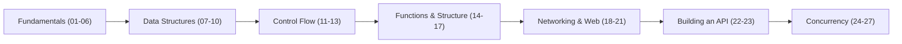

<div align="center">

# Go Programming — A Hands-On Curriculum

### From `Hello, World` to a concurrent, MongoDB-backed REST API — one topic per commit.

[](https://go.dev/)
[](#curriculum)
[](https://github.com/AhmadHussainRandhawa/go-programming/commits/main)
[](#why-this-repo-exists)

**[Why This Exists](#why-this-repo-exists) · [Curriculum](#curriculum) · [Learning Path](#learning-path) · [Running Any Example](#running-any-example) · [What's Next](#whats-next)**

</div>

<br>

## Why This Repo Exists

This isn't a tutorial followed once and forgotten. It's a working record of learning Go from first principles, one deliberate topic at a time — kept public because the path from *"what is a pointer"* to *"here's a concurrent API talking to MongoDB"* is exactly the path a lot of backend-curious developers are looking for, and most Go resources either stay too abstract or jump too fast.

Every numbered folder is a self-contained, runnable example targeting **one concept and one concept only**. No folder tries to teach three things at once — that constraint is deliberate. It's much easier to actually understand `defer` when it isn't sharing a file with goroutines and error handling.

If you're learning Go and want a path that goes from syntax basics all the way to the concurrency and networking primitives that actually matter for backend work, clone this and follow it in order.

---

## Curriculum

27 modules, organized into seven phases that build on each other. Each folder name is exactly what's in the repo — click through to the code.

### Phase 1 — Language Fundamentals

| # | Module | Concept |
|---|---|---|
| 01 | [`01hello`](01hello) | Program structure, `package main`, `fmt` |
| 02 | [`02variables`](02variables) | Variable declaration, types, `:=` vs `var` |
| 03 | [`03userinput`](03userinput) | Reading input from stdin |
| 04 | [`04conversion`](04conversion) | Type conversion between numeric and string types |
| 05 | [`05mytime`](05mytime) | Working with Go's `time` package |
| 06 | [`06mypointers`](06mypointers) | Pointers, memory addresses, dereferencing |

### Phase 2 — Data Structures

| # | Module | Concept |
|---|---|---|
| 07 | [`07myarray`](07myarray) | Fixed-size arrays |
| 08 | [`08myslilce`](08myslilce) | Slices — dynamic arrays, `append`, capacity |
| 09 | [`09mymaps`](09mymaps) | Key-value storage with `map` |
| 10 | [`10mystruct`](10mystruct) | Structs — Go's approach to composite types |

### Phase 3 — Control Flow

| # | Module | Concept |
|---|---|---|
| 11 | [`11ifelse`](11ifelse) | Conditionals |
| 12 | [`12switchcase`](12switchcase) | `switch` statements |
| 13 | [`13loops`](13loops) | Go's single loop construct, `for`, in all its forms |

### Phase 4 — Functions & Program Structure

| # | Module | Concept |
|---|---|---|
| 14 | [`14functions`](14functions) | Functions, multiple return values, variadic args |
| 15 | [`15methods`](15methods) | Methods on structs, value vs. pointer receivers |
| 16 | [`16defer`](16defer) | `defer`, execution order, cleanup patterns |
| 17 | [`17files`](17files) | Reading and writing files |

### Phase 5 — Networking & Web Fundamentals

| # | Module | Concept |
|---|---|---|
| 18 | [`18webrequests`](18webrequests) | Making HTTP requests from Go |
| 19 | [`19urls`](19urls) | Parsing and constructing URLs |
| 20 | [`20requestServer`](20requestServer) | Writing an HTTP server with `net/http` |
| 21 | [`21myjson`](21myjson) | Encoding and decoding JSON |

### Phase 6 — Building a Real API

| # | Module | Concept |
|---|---|---|
| 22 | [`22buildapi`](22buildapi) | Putting it together: a working REST API |
| 23 | [`23mongoapi`](23mongoapi) | Persisting API data with MongoDB |

### Phase 7 — Concurrency

| # | Module | Concept |
|---|---|---|
| 24 | [`24goroutines`](24goroutines) | Goroutines — Go's lightweight concurrency primitive |
| 25 | [`25waitgroup`](25waitgroup) | `sync.WaitGroup` — waiting for concurrent work to finish |
| 26 | [`26mutex`](26mutex) | `sync.Mutex` — protecting shared state |
| 27 | [`27channels`](27channels) | Channels — Go's way of communicating between goroutines |

---

## Learning Path

The order isn't arbitrary — each phase depends on the one before it. Data structures need variables; the API needs JSON and HTTP; concurrency is deliberately last, because goroutines, mutexes, and channels are far easier to reason about once the sequential fundamentals are second nature.



**The narrative arc, in one sentence:** learn the language, learn to structure data and programs with it, learn to talk over HTTP and JSON, build a real API, then learn to make that API concurrent and safe under shared state — which is the actual job of a Go backend engineer.

---

## Running Any Example

Every module is a self-contained `main` package. No cross-module dependencies, no shared state to set up first.

```bash
# Clone the repository
git clone git@github.com:AhmadHussainRandhawa/go-programming.git
cd go-programming

# Run any module directly
cd 13loops
go run .
```

For modules with external dependencies — `23mongoapi` needs a running MongoDB instance; `18webrequests` and `20requestServer` need network access — check that module's folder for any module-specific setup notes.

**Prerequisite:** [Go 1.22+](https://go.dev/dl/) installed and on your `PATH`. Verify with:

```bash
go version
```

---

## What's Next

This repo grows as the learning continues. Planned additions:

- [ ] Error handling patterns (custom errors, `errors.Is` / `errors.As`, wrapping)
- [ ] Interfaces and Go's implicit interface satisfaction
- [ ] Generics (Go 1.18+ type parameters)
- [ ] Context (`context.Context`) for cancellation and deadlines in concurrent code
- [ ] Testing in Go (`testing` package, table-driven tests)
- [ ] A `LICENSE` file — this repo doesn't have one yet; MIT is the likely choice once added

---

## A Note on Code Quality

These are learning modules, not production code — some are intentionally minimal to isolate a single concept as clearly as possible. If you're a Go developer more experienced than the code in a given folder suggests, and you spot a pattern that's genuinely wrong (not just non-idiomatic for a teaching example), an issue or PR pointing it out is welcome and will be taken seriously — that's exactly the kind of feedback that makes a learning-in-public repo worth keeping public.

---

## Contact

**Ahmad Hussain Randhawa**

- Email: official.ahmadrandhawa@gmail.com
- LinkedIn: [ahmad-hussain-randhawa](https://www.linkedin.com/in/ahmad-hussain-randhawa/)
- GitHub: [@AhmadHussainRandhawa](https://github.com/AhmadHussainRandhawa)

If you're also learning Go and this path is useful to you, a star helps others find it — and if you build on it or spot something worth improving, I'd genuinely like to hear about it.
